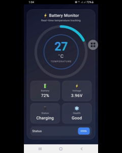

# ⚡ Android Battery Temperature Monitor

A modern **Android battery monitoring app** built with **Jetpack Compose** that displays **real-time battery temperature**, charge level, voltage, charging status and battery health — all wrapped in a sleek animated UI.

## 📸 App Demo



---

## 🚀 Features

- 🔥 **Real-time battery temperature tracking**
- 🔋 Battery level percentage
- ⚡ Battery voltage monitoring
- 🔌 Charging / discharging status
- ❄️ Battery health detection (Good, Cold, Overheat, Dead)
- 🎨 Modern **Jetpack Compose UI**
- 💎 Glassmorphism card design
- 🌈 Animated circular temperature gauge
- 🌙 Dark mode–friendly interface

---

## 🛠 Tech Stack

- **Language:** Kotlin
- **UI:** Jetpack Compose
- **Architecture:** Single-Activity (Compose-first)
- **System APIs:** `BatteryManager`, `ACTION_BATTERY_CHANGED`
- **Design:** Material 3, custom animations

---

## 📱 How It Works

The app listens to Android’s system battery broadcasts using:

- `Intent.ACTION_BATTERY_CHANGED`
- `BatteryManager` properties

It continuously updates:
- Battery temperature (°C)
- Voltage (V)
- Charge level (%)
- Charging state
- Health status
---

## ▶️ Getting Started

### Prerequisites
- Android Studio Hedgehog or newer  
- Android SDK 26+  
- Kotlin 1.9+  

---

### Clone the Repository

```bash
git clone https://github.com/alsaeeddev/battery-health-checker-app.git